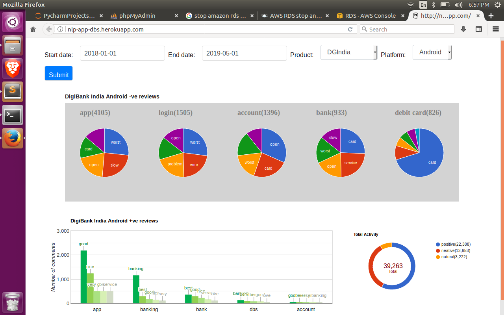
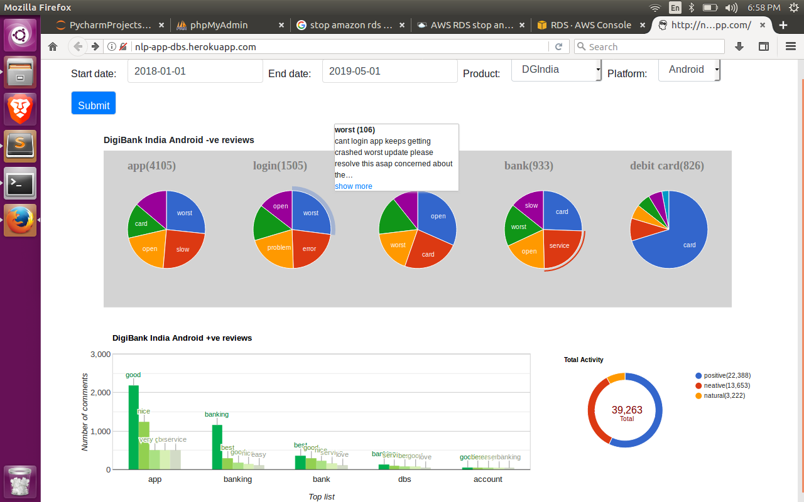
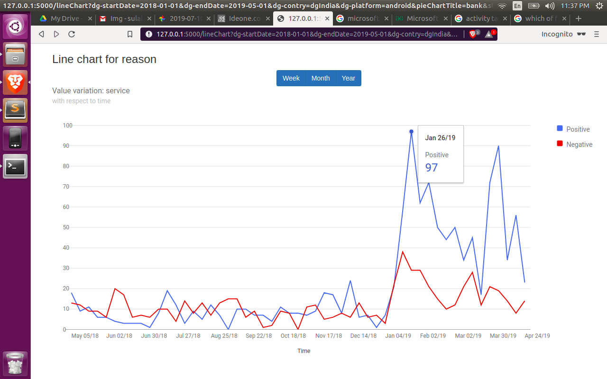

# Play store comments analysis

Textual analysis on reviews to extract users pain points

[]() []()

Idea behind of this project was to facilitate admin/management to know company **products status** specifically Android application.

Every product management is interested to know:
1. Position of product among global audience?
2. what are users discussion about it?
3. How good or bad it is?
4. What are feature preforming well and what not?
5. Reason why so negative or positive?
6. Monitoring performance of product for each release?

I started this project as POC for my current organization. Aim is to solve above questions by scraping play store reviews, ratings for application dump it to Database and apply Machine Learning algorithm, Textual analysis into it.

**Note**: currently project is on pause due to unavailability of resources.

<imgs src="https://i.ibb.co/TKBny0n/1935.pngg" width="300"/>
<imgs src="https://i.ibb.co/9YqY1w3/1935.png" width="300"/>

### Prerequisites
**Data collection**
- python selenium
- cron job (scraping comments periodically and dumps into DB)

**For development:**
- python3
- virtualenv
- pip3
- Python3-flask
- google-chart APIs
- pandas
- MySQL DB
- Amazon RDS

**For web hosting:**
- heroku account
- heroku-cli

### setup & installation

Setup virtualenv

```sh
virtualenv --python=python3.5 venv
source venv/bin/activate
```

```sh
git clone https://github.com/sulabh9999/play_store_comment_analysis.git
cd play_store_comment_analysis
pip3 install -r requirements.txt
python3 application.py
```
open url on browser to get default window
```
localhost:8080
```

Here admin can enter start date, end date, product name and platform(Android/iOS).
It plots below graph, where:
- Multi colored pie chart shows top 5(default) pain(-ve) points that users are discussion frequently, and slices shows reasons.
- Green colored histogram shows +ve point
- Circular chart shows overall performance



When user hovers over slice of pie chart. Tool tip pops up with the latest comment which explain reason with "show more" option.
Tooltip is to give transparency and accuracy for statistics shown on dashboard.



On pressing slice navigates to line graph screen, shows trends of reason over time interval, also can be customized to show weekly, monthly, yearly report.

 


## Authors

* [Sulabh Shukla](https://in.linkedin.com/in/sulabh-shukla-8a675794) - *Initial work* - [Open source contributer](https://github.com/sulabh9999), [Ex-DBS](https://www.dbs.com/in/index/default.page)

## Co-ordinator
* [Nikhil Mahen](https://in.linkedin.com/in/nikhil-mahen-50149b10) - *Initial work* - [CEO at Releaf Today, Ex-DBS](https://in.linkedin.com/in/nikhil-mahen-50149b10)
